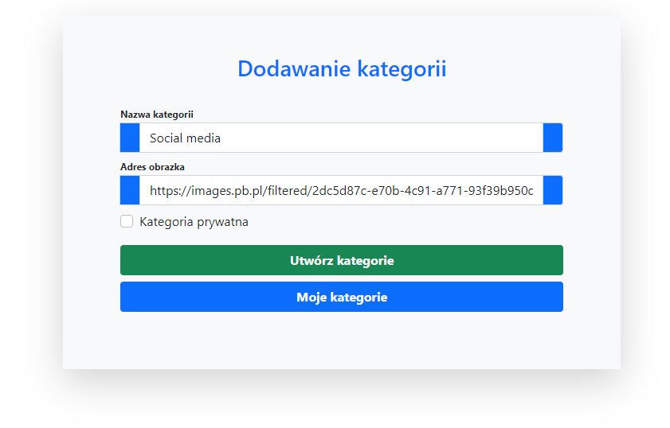
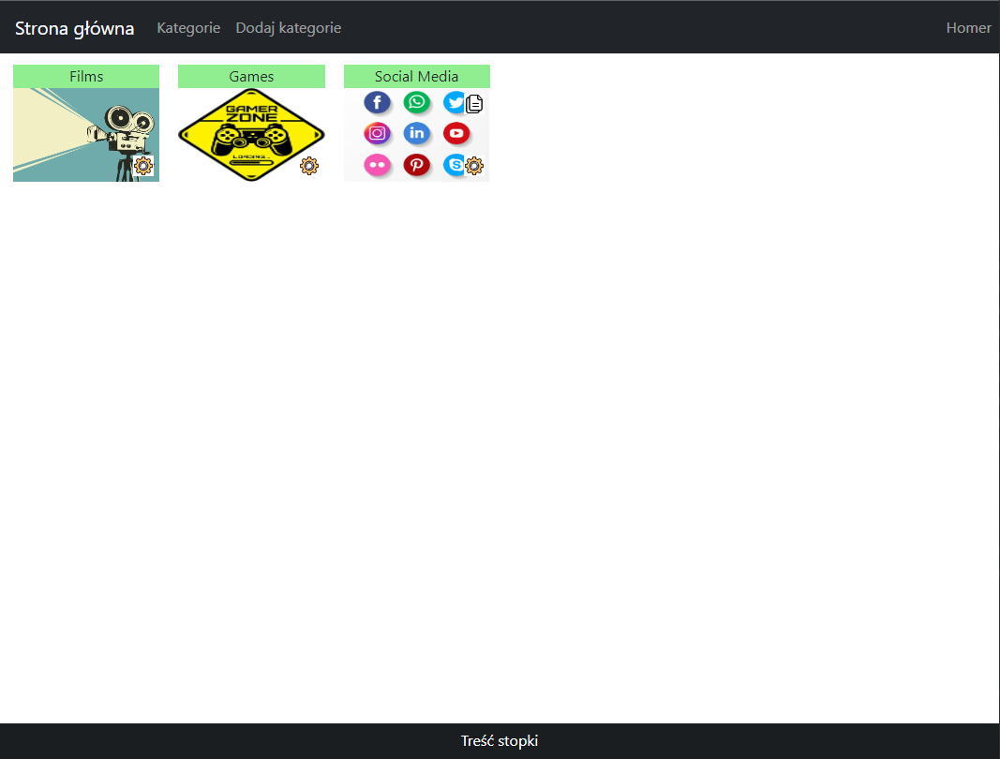
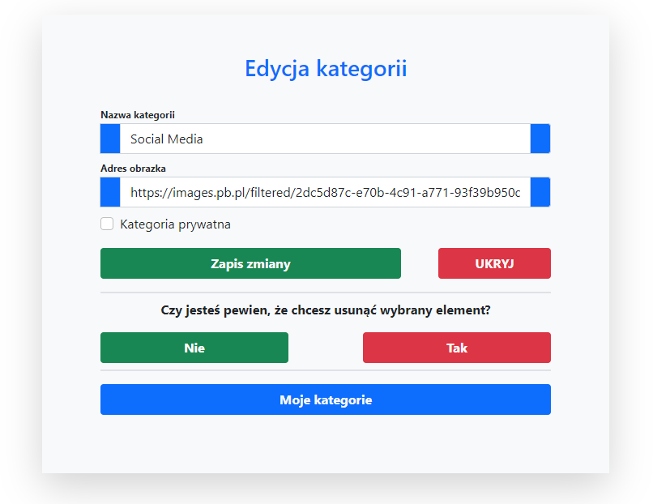
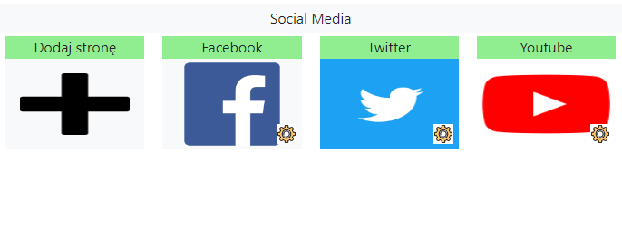
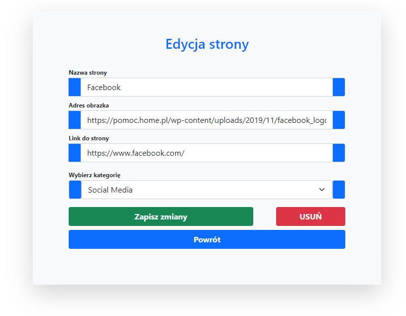
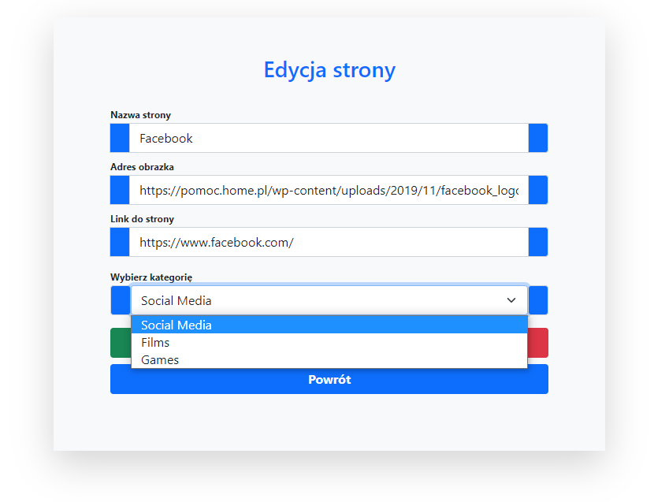
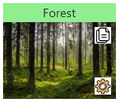

# Bookmarks
It is a system that allows you to share multiple links with a single link. Project used [started pack for php](https://github.com/dawidbros1/php-start).

## Build with
1. PHP 7.4
2. BOOTSTRAP 5

## Features
1. Adding categories and pages
2. Changing the parent for the pages
3. Access to public content without logging in

## Installation Instructions
1. Run `git clone https://github.com/dawidbros1/bookmarks.git`
2. Run `composer install`
3. Create a MySQL database for the project
4. From the project root folder run cd `/config/` and next `copy config_dist.php config.php`
5. Configure your `/config/config.php` file
6. Import tables from file `/sql/database.sql` to your database

## Table of contents
- [Screenshots](#screenshots)
- [Controllers](#controllers)
    - [CategoryController](#categorycontroller)
    - [PageController](#pagecontroller)
- [Models](#models)
    - [Category](#category)
    - [Page](#page)
- [Repositories](#repositories)
    - [CategoryRepository](#categoryrepository)
- [Components](#components)
    - [Available components](#available-components)

## Screenshots
<kbd>














</kbd>

## Controllers
### CategoryController
* **__construct(Request $request)**: If category is public we don't need be logged in to look content.
```
if ($this->request->getParam('action') != "public") $this->requireLogin();
```

* **createAction()**: Method creates category by `$this->model->create($data)`

* **listAction()**: Method gets all categories for current logged in user and shows it.
```
$categories = $this->model->findAll(["user_id" => User::ID()], "ORDER BY name ASC");
$this->view->render('category/list', ['categories' => $categories, 'location' => $this->request->url()]);
```
Location is a parameter which is helpful to create link to share. It is a name of domain + folder of project like a `http://localhost/folder/`.

* **editAction()**: Method gets category by `$this->category(false)` and next update it by `$category->update($data)`.

* **deleteAction()**: Method deletes category with pages by `$this->category(true)->delete()`.

* **showAction()**: Method gets category by `$this->category(true)` and next adds element create page to list
```
$page = new Page([
    'name' => "Add page",
    'image' => "public/images/Item/plus.png",
    'link' => self::$route->get('page.create') . "&category_id=$category->id",
]);

array_unshift($category->pages, $page);
```

and at the end shows it by
```
$this->view->render('category/show', ['category' => $category, 'manage' => true]);
```
Manage is a parameter which is use to show setting icon.

* **publicAction()**: Method checks if category is a public and shows it.
```
if (($category = $this->category(true, false)) && $category->private == false) {
    $this->view->render('category/show', ['category' => $category, 'manage' => false]);
}
```

* **category(bool $relation = true, $auth = true)**: Method returns category taking into account relationships and access rights.
```
private function category(bool $relation = true, $auth = true)
{
    $id = (int) $this->request->param('id');
    $this->model->relation = $relation;

    if ($auth === true) {
        $category = $this->model->find(["id" => $id, "user_id" => User::ID()]);
    } else {
        $category = $this->model->find(["id" => $id]);
    }

    if ($category == null) {
        Session::error('You are not authorized to this resource');
        $this->redirect('category.list');
    }

    return $category;
}
```

### PageController
* **createAction()**: Method creates page into category by check if logged in user has laws to category
```
if ($this->category->find(['id' => $category_id, 'user_id' => User::ID()]) != null) {...}
```
and next save it in database by `$this->model->create($data)`.

* **editAction()**: Method gets page by `$this->page()` and next update it. In this case we can also change parent category of page so we also need check if we are author of changed category.
```
if ($page->category_id == $data['category_id'] || $this->category->find(["user_id" => User::ID(), "id" => $data['category_id']])) {
    Session::set('error:category_id:author', 'You are not the author of the selected category');
} else {
    $page->update($data);
}
```

* **deleteAction()**: Method gets page by `$this->page()` and next delete it by `$page->delete()`.

* **page()**: Method returns page with given id from request and also checks laws to page.
```
private function page()
{
    if ($page = $this->model->findById($this->request->param('id'))) {
        if ($this->category->find(["id" => $page->category_id, "user_id" => User::ID()])) {
            return $page;
        }
    }

    Session::error('You are not authorized to this resource');
    $this->redirect('category.list');
}
```

## Models
### Category
* **create(array $data, $validate = true)**: Method create category.

* **delete(?int $id = null)**: Method deletes category and pages from category.
```
$this->repository->deletePages($this->id);
parent::delete();
```

* **find(array $input, $options = "")**: Method gets pages of category if the property relation is set to value true.
```
$category = parent::find($input);
...
if ($this->relation == true) {
    $category->pages = $this->repository->pages((int) $category->id);
}
```

### Page
* **create(array $data, $validate = true)**: Method create page.

* **delete(?int $id = null)**: Method deletes page by `parent::delete()`.

## Repositories
### CategoryRepository
* **deletePages($category_id)**: Method deletes pages of category.
```
public function deletePages($category_id)
{
    $sql = "DELETE FROM pages WHERE category_id = :category_id";
    self::$pdo->prepare($sql)->execute(['category_id' => $category_id]);
}
```

* **pages(int $category_id)**: Method returns pages of category.
```
public function pages(int $category_id)
{
    $pages = [];
    $stmt = self::$pdo->prepare("SELECT * FROM pages WHERE category_id=:category_id ORDER BY name ASC");
    $stmt->execute(['category_id' => $category_id]);
    $data = $stmt->fetchAll(PDO::FETCH_ASSOC);

    if (!empty($data)) {
        foreach ($data as $properties) {
            $pages[] = new Page($properties);
        }
    }

    return $pages;
}
```

## Components
### Available components
* **item.category**: Component renders category in (category.list).
```
$category = new category([
    'id' => 1,
    'user_id' => User::ID(),
    'name' => "Forest",
    'image' => "https://bi.im-g.pl/im/79/92/17/z24715385V,Las.jpg",
    'private' => 0,
]);

Component::render('item.category', [
    'category' => $category,
    'route' => $route, 
    'location' => "http://localhost/my-bookmarks-php-v2/",
]);
```


* **item.page**: Component renders page in (category.show and category.public).
```
$page = new Page([
    'id' => "1",
    'category_id' => "1",
    'name' => "Facebook",
    'image' => "https://upload.wikimedia.org/wikipedia/commons/thumb/f/fb/Facebook_icon_2013.svg/640px-Facebook_icon_2013.svg.png",
    'link' => "https://www.facebook.com/",
]);
```

In **category.show** author can see button to edit page.
```
Component::render('item.page', [
    'page' => $page,
    'route' => $route,
    'manage' => true,
])
```


In **category.public** no one can see button to edit page. Access only for public categories.
```
Component::render('item.page', [
    'page' => $page,
    'route' => $route,
    'manage' => false,
])
```


* **item.form.open**: Component renders start of the form which adds category or page.
* **item.form.close**: Component renders end of the form which adds category or page.
