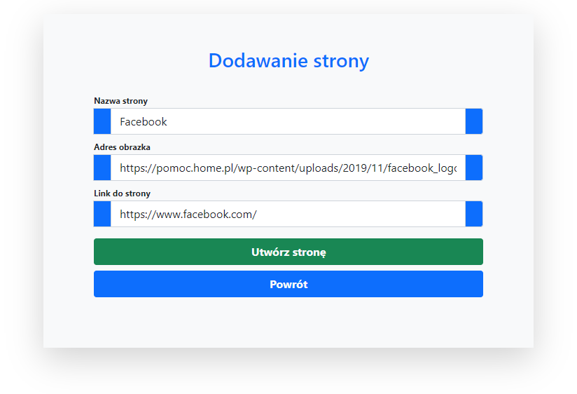
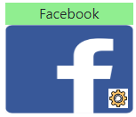

# Bookmarks
It is a system that allows you to share multiple links with a single link. Project used [started pack for php](https://github.com/dawidbros1/php-start/tree/version_1.0).

## Build with
1. PHP 7.4
2. BOOTSTRAP 5

## Features
1. Adding categories and pages
2. Changing the parent for the pages
3. Access to public content without logging in

## Installation Instructions
1. Run `git clone https://github.com/dawidbros1/bookmarks.git`
2. Run `composer install`
3. Create a MySQL database for the project
4. From the project root folder run `cd config` and next `copy config_dist.php config.php`
5. Configure your `/config/config.php` file
6. Import tables from file `/sql/database.sql` to your database

## Table of contents
- [Screenshots](#screenshots)
- [Components](#components)

## Screenshots
<kbd>





</kbd>

## Components
* **item.category**: Component renders category in (category.list).
```
$category = new category([
    'id' => 1,
    'user_id' => User::ID(),
    'name' => "Forest",
    'image' => "https://bi.im-g.pl/im/79/92/17/z24715385V,Las.jpg",
    'private' => 0,
]);

Component::render('item.category', [
    'category' => $category,
    'route' => $route, 
    'location' => "http://localhost/my-bookmarks-php-v2/",
]);
```


* **item.page**: Component renders page in (category.show and category.public).
```
$page = new Page([
    'id' => "1",
    'category_id' => "1",
    'name' => "Facebook",
    'image' => "https://upload.wikimedia.org/wikipedia/commons/thumb/f/fb/Facebook_icon_2013.svg/640px-Facebook_icon_2013.svg.png",
    'link' => "https://www.facebook.com/",
]);
```

In **category.show** author can see button to edit page.
```
Component::render('item.page', [
    'page' => $page,
    'route' => $route,
    'manage' => true,
])
```


In **category.public** no one can see button to edit page. Access only for public categories.
```
Component::render('item.page', [
    'page' => $page,
    'route' => $route,
    'manage' => false,
])
```


* **item.form.open**: Component renders start of the form which adds category or page.
* **item.form.close**: Component renders end of the form which adds category or page.